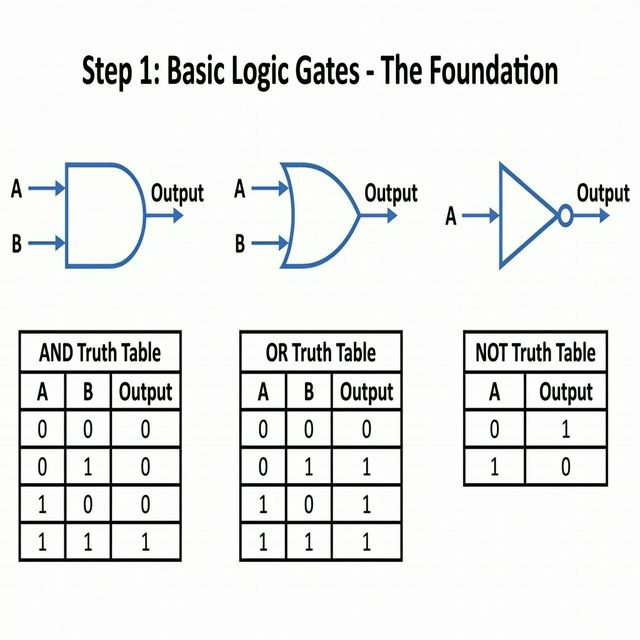
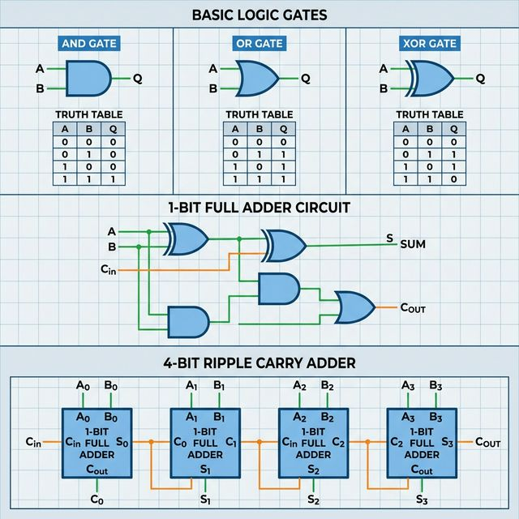
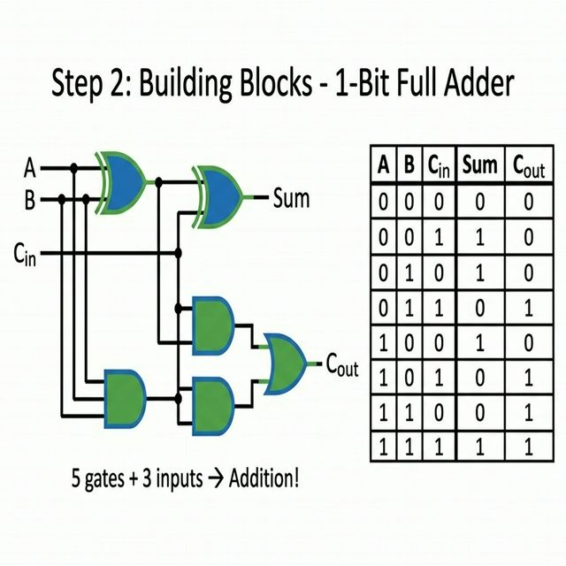
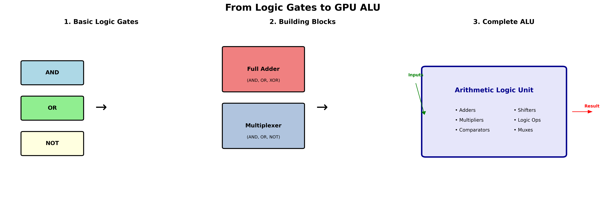
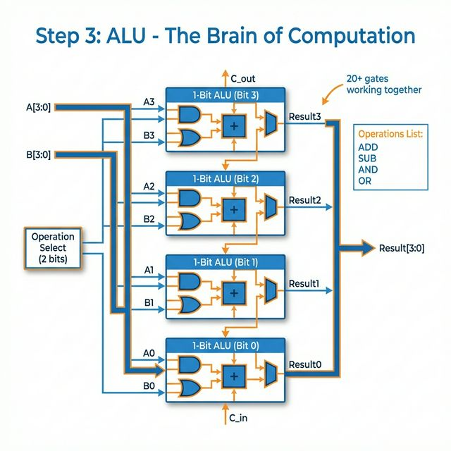
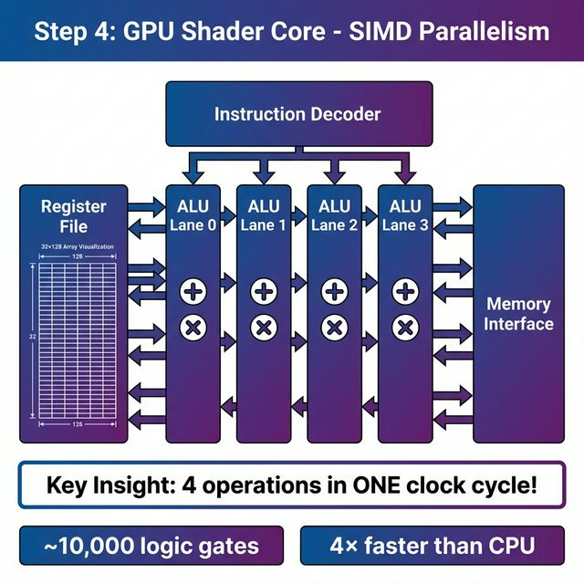
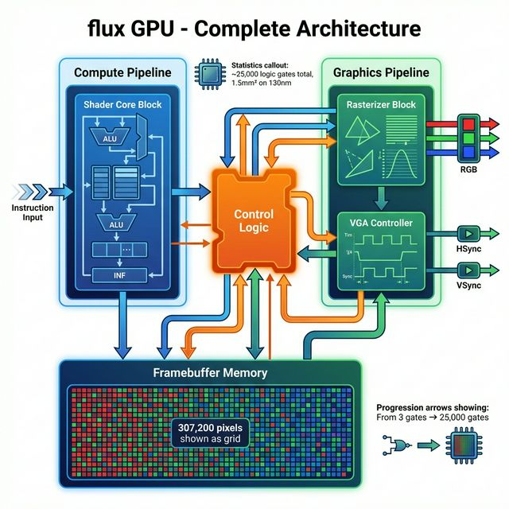
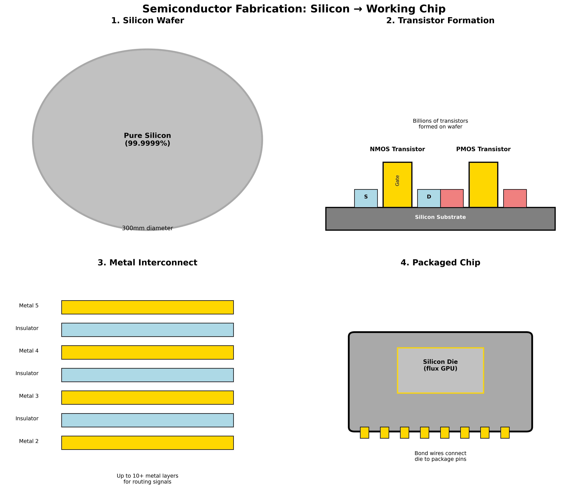

# flux GPU - Visual Documentation Gallery

**Complete visual guide from atoms to working GPU**

**🎯 Mission**: Democratizing GPU building by making complex concepts accessible through clear, professional visualizations.

---

## The Complete Journey

### 1. From Atoms to GPUs


**The entire path**: Atoms → Transistors → Logic Gates → ALU → Complete GPU

---

## Logic Gates & Building Blocks

### Basic Logic Gates



**Fundamental building blocks**: AND, OR, NOT, NAND, NOR, XOR gates

### Gates to Adder



**Building up complexity**: How logic gates combine to create a full adder

### Full Adder Circuit



**Complete design**: Input bits A, B, Carry-in → Sum, Carry-out

### Logic Gates to ALU



**Three-stage progression**: Basic gates → Building blocks → Complete ALU

---

## Arithmetic Logic Unit (ALU)

### ALU Architecture



**4-wide SIMD design**: Four parallel ALU lanes processing data simultaneously

### SIMD Visualization


**Parallelism in action**: Single instruction operates on 4 data elements at once

**Example**: One ADD instruction performs 4 additions in 1 clock cycle = 4× speedup!

---

## GPU Architecture

### Shader Core



**Compute pipeline**: Register file, instruction decoder, SIMD ALU working together

### Complete GPU Architecture



**Full system view**: Shader core (compute) + Graphics pipeline + Memory system + Control unit

### System Overview (Detailed)


**Color-coded components**:
- 🔵 Blue: Compute pipeline
- 🟢 Green: Graphics pipeline  
- 🟠 Orange: Memory system
- 🟣 Purple: Control unit

---

## Chip Fabrication

### Silicon to Chip Process



**Four stages**:
1. Pure silicon wafer (300mm)
2. Transistor formation (NMOS, PMOS)
3. Metal interconnect layers (10+ layers)
4. Packaged chip ready to use

---

## How to Use These Images

### In Documentation
```markdown

```

### In Presentations
- High resolution (300 DPI)
- Professional quality
- Color-coded for clarity

### For Learning
1. **Start**: `atoms_to_gpu_journey.png` - See the big picture
2. **Foundations**: `logic_gates_basics.png` - Understand basic building blocks
3. **Building Up**: `gates_to_adder.png`, `full_adder_circuit.png` - See how gates combine
4. **ALU**: `alu_architecture.png`, `simd_visualization.png` - Understand parallel processing
5. **Complete System**: `complete_gpu_architecture.png` - See how everything connects
6. **Physical Reality**: `chip_fabrication.png` - Understand real silicon

---

## Creating More Diagrams

Want to generate additional diagrams?

```bash
python docs/generate_diagrams.py
```

This script creates:
- Architecture diagrams
- Block diagrams
- Flow charts
- System overviews

Edit the script to customize or add new diagrams!

---

## Image Specifications

| Image | Size | Resolution | Format |
|-------|------|------------|--------|
| All diagrams | Variable | 300 DPI | PNG |
| Color space | RGB | Standard | True color |
| Background | White/Transparent | - | Compatible with docs |

---

## License

All images are licensed under **CC-BY-SA 4.0** (same as documentation).

You may:
- ✅ Use in presentations
- ✅ Include in papers
- ✅ Modify and adapt
- ✅ Commercial use (with attribution)

Must:
- 📝 Attribute to flux GPU project
- 🔄 Share modifications under same license

---

**These visuals make flux GPU concepts accessible to everyone!** 🎨
