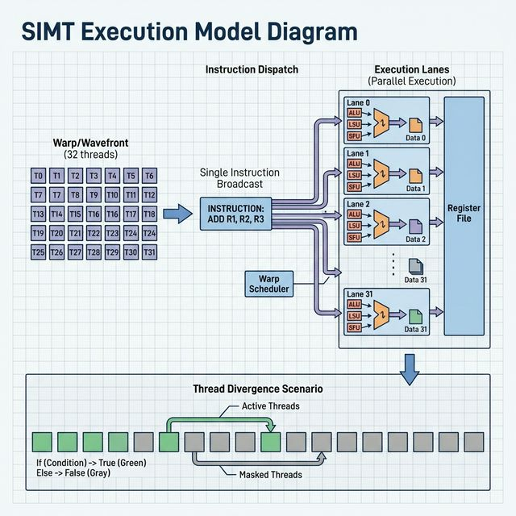
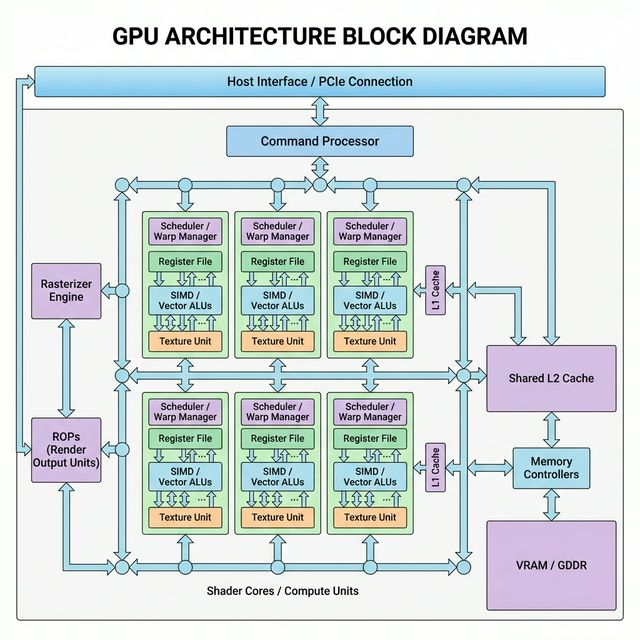
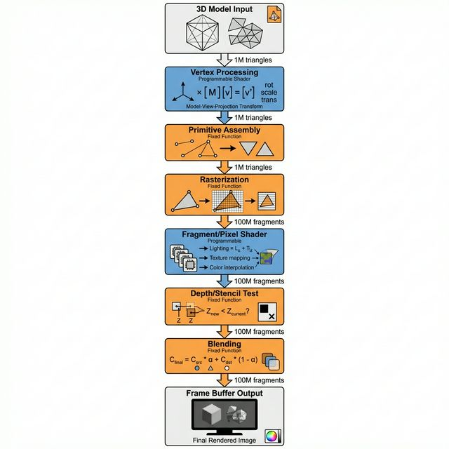
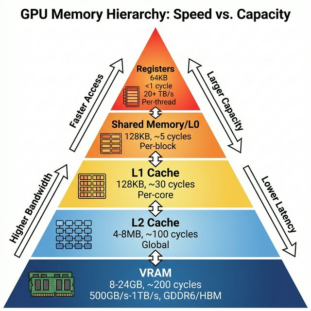

# GPU Fundamentals: Building From First Principles

## Table of Contents
1. [Why GPUs Exist](#why-gpus-exist)
2. [Parallel Processing Fundamentals](#parallel-processing-fundamentals)
3. [GPU Architecture Overview](#gpu-architecture-overview)
4. [Execution Models](#execution-models)
5. [Memory Systems](#memory-systems)

---

## Why GPUs Exist

### The Parallel Processing Problem

Modern graphics and compute workloads are **embarrassingly parallel**—they involve performing the same operation on millions of independent data elements.

**Example: Rendering a 1920×1080 image**
- 2,073,600 pixels to compute
- Each pixel calculation is independent
- Serial processing: compute one pixel at a time
- Parallel processing: compute thousands of pixels simultaneously

**Physics Constraint**: 
- CPUs optimize for **latency** (fast single-thread performance)
- GPUs optimize for **throughput** (maximum parallel work)

### The Silicon Trade-off

Given a fixed chip area budget (e.g., 500mm²):

**CPU Approach**: 
- 4-16 massive cores
- Each core: complex out-of-order execution, branch prediction, large caches
- Goal: Minimize time to complete one task

**GPU Approach**:
- 1000s of small, simple cores
- Minimal control logic per core
- Goal: Maximize tasks completed per second

---

## Parallel Processing Fundamentals

### SIMD vs SIMT

**SIMD (Single Instruction, Multiple Data)**
- One instruction executed on a vector of data
- Example: `ADD [R1], [R2], [R3]` adds 16 elements simultaneously

**SIMT (Single Instruction, Multiple Threads)**
- GPU's approach: Each thread *appears* independent but executes in lockstep
- Hardware groups threads into **warps** (NVIDIA) or **wavefronts** (AMD)
- Typical warp size: 32 threads



**Also available:** [Text version with examples](../diagrams/shader_execution_model.txt)

### Thread Hierarchy

```
GPU Program (Kernel)
├── Grid (all thread blocks)
│   ├── Thread Block 0 (e.g., 256 threads)
│   │   ├── Warp 0 (threads 0-31)
│   │   ├── Warp 1 (threads 32-63)
│   │   └── ...
│   ├── Thread Block 1
│   └── ...
```

**Key Insight**: Threads in a warp execute the same instruction at the same time. If threads diverge (e.g., if-else branch), the hardware serializes execution.

---

## GPU Architecture Overview



**Also available:** [Text version](../diagrams/gpu_architecture_overview.txt)

### Major Components

#### 1. **Shader Cores** (a.k.a. Streaming Multiprocessors, Compute Units)
- The workhorses of the GPU
- Each contains:
  - **SIMD/SIMT execution units**: 64-128 ALUs operating in parallel
  - **Texture units**: Hardware for sampling/filtering textures
  - **Load/Store units**: Memory access paths
  - **Scheduler**: Decides which warp to execute each cycle

#### 2. **Memory Subsystem**
- **Registers**: Fastest storage (per-thread)
- **Shared Memory**: Programmable low-latency cache (per-block)
- **L1/L2 Caches**: Automatic caching hierarchy
- **Memory Controller**: Interfaces with VRAM (GDDR6/HBM)

#### 3. **Raster Engine** (Graphics-specific)
- **Triangle Setup**: Computes edge equations for rasterization
- **Rasterizer**: Generates pixel fragments from triangles
- **Attribute Interpolation**: Computes per-pixel values (colors, UVs)

#### 4. **ROPs** (Render Output Units)
- **Depth/Stencil Testing**: Z-buffer operations
- **Blending**: Combines fragment with framebuffer (alpha blending)
- **Compression**: Lossless color/depth compression

#### 5. **Command Processor**
- Parses command buffers from CPU
- Dispatches work to shader cores and raster engine

---

## Execution Models

### Graphics Pipeline



**Stages**:
1. **Vertex Shader**: Transforms 3D vertices (model → world → view → clip space)
2. **Primitive Assembly**: Groups vertices into triangles
3. **Rasterization**: Converts triangles to pixel fragments
4. **Fragment Shader**: Computes per-pixel color (lighting, texturing)
5. **Depth/Stencil Test**: Discards occluded fragments
6. **Blending**: Composites with framebuffer

**Example Workload**:
- Input: 1 million triangles
- After rasterization: 100 million fragments (pixels)
- Massive parallelism opportunity at fragment stage

### Compute Pipeline

**Simplified Model**:
1. CPU enqueues kernel launch: `kernel<<<blocks, threads>>>(args)`
2. GPU command processor receives task
3. Scheduler assigns thread blocks to shader cores
4. Each core executes warps until completion
5. Results written back to memory

**Key Advantage**: Direct control over parallelism. No graphics-specific stages.

---

## Memory Systems



### Bandwidth Physics

**Fundamental Problem**: Compute is fast, memory is slow.

**Example Numbers (Hypothetical GPU)**:
- ALU throughput: 10 TFLOPS (trillion operations/sec)
- VRAM bandwidth: 500 GB/s
- Each FP32 operation needs 2× 4-byte inputs + 1× 4-byte output = 12 bytes
- **Bandwidth-limited throughput**: 500 GB/s ÷ 12 bytes = 41.7 GFLOPS
- **Compute:Bandwidth ratio**: 10,000 ÷ 41.7 = **240:1 imbalance**

**Solution**: Cache everything aggressively.

### Memory Hierarchy Details

| Level | Size | Latency | Bandwidth | Scope |
|-------|------|---------|-----------|-------|
| Registers | 64KB/core | <1 cycle | ~20 TB/s | Per-thread |
| Shared Mem | 64KB/core | ~5 cycles | ~15 TB/s | Per-block |
| L1 Cache | 128KB/core | ~30 cycles | ~10 TB/s | Per-core |
| L2 Cache | 4MB | ~100 cycles | ~2 TB/s | Global |
| VRAM | 8-16GB | ~200 cycles | 500 GB/s | Global |

### Coalescing

**Critical Optimization**: Adjacent threads should access adjacent memory.

**Good access pattern** (coalesced):
```c
// Thread 0 reads address 0, thread 1 reads address 4, etc.
data[threadIdx.x] = ...;  // One 128-byte transaction
```

**Bad access pattern** (scattered):
```c
// Random access pattern
data[random[threadIdx.x]] = ...;  // 32 separate transactions!
```

---

## Physics & Logic Deep Dive

### Why 32-thread Warps?

**Trade-off**:
- **Smaller warps** (e.g., 8 threads): Less wasted work on divergence, but more scheduling overhead
- **Larger warps** (e.g., 64 threads): Better amortization of instruction fetch, but more divergence waste

**32 threads** is a sweet spot:
- Matches cache line size (128 bytes ÷ 4 bytes/element = 32 elements)
- Balances control overhead vs. execution efficiency
- Enables efficient SIMD datapaths (e.g., 8× 4-wide SIMD units)

### Power & Thermal Physics

**Power Equation**: P = CV²f
- C = capacitance (proportional to transistor count)
- V = voltage
- f = frequency

**GPU Strategy**:
- Lower voltage/frequency than CPUs (1.0 GHz vs 5.0 GHz)
- Massively increase parallelism (more transistors doing useful work)
- Result: 10× performance/watt vs. CPU on parallel workloads

**Thermal Constraint**:
- Modern GPUs: 250-450W TDP
- Requires advanced cooling (vapor chambers, large heatsinks)
- Frequency throttling when temp exceeds ~80-90°C

---

## Building Your Own GPU: Key Insights

1. **Start Simple**: A single shader core with 4-8 execution lanes is sufficient to learn
2. **Memory is Hard**: Spend time on cache controllers and coalescing logic
3. **Verification**: Use waveform debugging extensively (GTKWave, Verdi)
4. **Incremental Complexity**: 
   - Week 1: ALU + register file
   - Week 2: Instruction fetch/decode
   - Week 3: Memory interface
   - Week 4: First working shader execution
5. **Tooling**: Verilator for simulation, Yosys for synthesis, cocotb for verification

**Next Steps**: See [Pipeline Explained](pipeline_explained.md) for detailed stage-by-stage implementation guidance.
